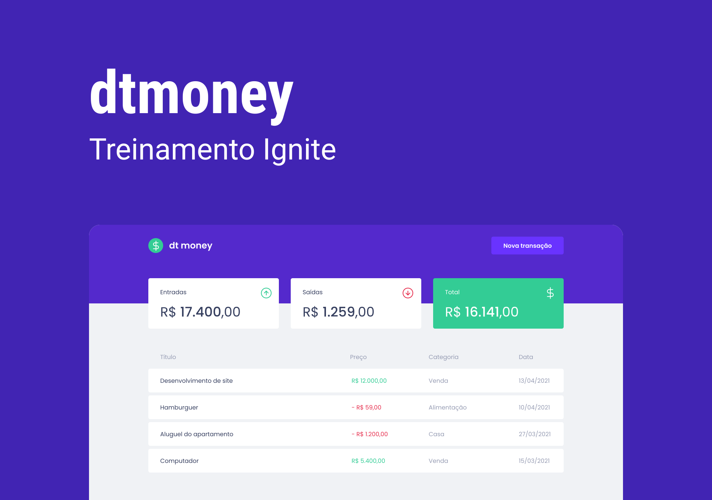

<p align="center">
  
</p>

<p align="center">
  
  
  

     
</p>

<h1 align="center" title="dt money">
    
</h1>

<h4 align="center"> 
	🚧 Concluído 🚀 🚧
</h4>

<p align="center">
 <a href="#-sobre-o-projeto">Sobre</a> •
 <a href="#-funcionalidades">Funcionalidades</a> •
 <a href="#-tecnologias">Tecnologias</a> • 
 <a href="#-layout">Layout</a> • 
 <a href="#-como-executar-o-projeto">Como executar</a> • 
 <a href="#-autor">Autor</a> • 
 <a href="#user-content--licença">Licença</a>
</p>

## 💻 Sobre o projeto

O dt money é uma aplicação de controle de finanças pessoais onde o usuário pode gerenciar entradas e saídas de dinheiro.

## ⚙️ Funcionalidades

- [x] Os usuários podem cadastrar transações;
- [x] Todas as transações são exibidas em uma tabela;
- [x] É mostrado um resumo com todas as entradas, saídas e o total de dinheiro.

## 🛠 Tecnologias

As seguintes ferramentas foram usadas na construção do projeto:

-   **[ReactJS](https://pt-br.reactjs.org/docs/getting-started.html)**
-   **[TypeScript](https://www.typescriptlang.org/)**
-   **[Styled Components](https://styled-components.com/)**
-   **[MirageJS](https://miragejs.com/)**
-   **[Axios](https://github.com/axios/axios)**
-   **[ContextAPI](#)**
-   **[Hooks](#)**


> Veja o arquivo  [package.json](https://github.com/tgmarinho/README-ecoleta/blob/master/web/package.json)

Utilitários

-   **[Create React App](https://create-react-app.dev/)**
-   **[Google Fonts](https://fonts.google.com/)**
-   **[React Modal](https://github.com/reactjs/react-modal)**
-   **[Polished](https://github.com/styled-components/polished)**
-   **[Intl]()**


## 🎨 Layout


## 🚀 Como executar o projeto

### Pré-requisitos

Antes de começar, você vai precisar ter instalado em sua máquina as seguintes ferramentas:
[Git](https://git-scm.com), [Node.js](https://nodejs.org/en/). 
Além disto é bom ter um editor para trabalhar com o código como [VSCode](https://code.visualstudio.com/)

```bash

# Clone este repositório
$ git clone git@github.com:DanielSouz4/dt-money.git

# Acesse a pasta do projeto no seu terminal/cmd
$ cd dt-money

# Instale as dependências
$ npm install

# Execute a aplicação em modo de desenvolvimento
$ npm run start

# A aplicação será aberta na porta:3000 - acesse http://localhost:3000

```

## 🦸 Autor

- [@DanielSouz4](https://github.com/DanielSouz4)

[](https://www.linkedin.com/in/danielsouzadev/) 
[](mailto:danielsouza51764@gmail.com)


## 📝 Licença

Este projeto esta sobe a licença [MIT](#).

Feito por Daniel Souza 👋🏽 [Entre em contato!](https://www.linkedin.com/in/danielsouzadev/)
